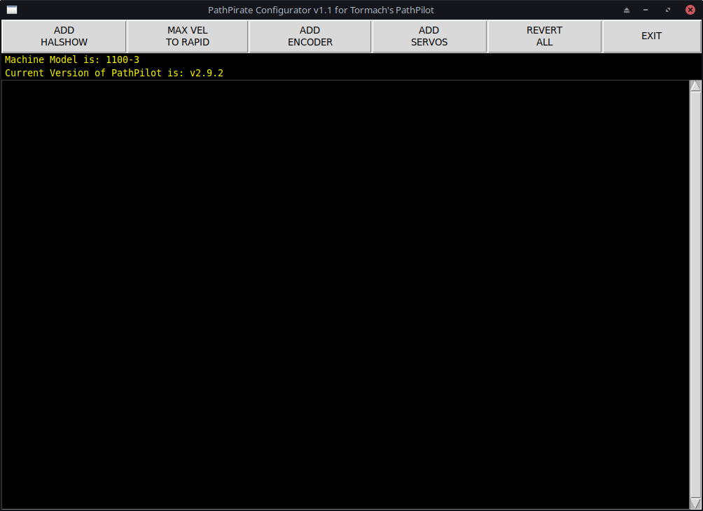

# PathPirate
A script for automated configuration changes to Tormach's PathPilot.

This script can be used on any Tormach machine as described below, however the "ADD ENCODER" and "ADD SERVOS" buttons will currently only show on an 1100-3 machine.



## Installation
### Requirements for using PathPirate are:
  * A working installation of Tormach's PathPilot v2.9.2 or greater
  * git (installed by default on PathPilot's stock image)

### To install PathPirate (from a running PathPilot screen):

Launch a terminal window by pressing ctrl+alt+x

Enter the following command in the terminal window:
```console
git clone https://github.com/snowgoer540/PathPirate.git ~/pathpirate
```

## Usage
### To launch PathPirate:

Enter the following command in the terminal window:
```console
python ~/pathpirate/pathpirate.py
```

### Buttons Explained:

* ADD HALSHOW - This button will add HALSHOW back to PathPilot. It can then be called by entering the MDI command "ADMIN HALSHOW". A local version (copied from the LinuxCNC github in January of 2023) included in this repository will be copied.
* MAX VEL TO RAPID - This button will change PathPilot's MAX VEL slider to a RAPID slider. This will allow the user to control the feed rate and rapid rates independently which is not possible using MAX VEL.
* ADD ENCODER - On an 1100-3 machine, this button will make the necessary modifications to the current version's INI and HAL files to add a spindle encoder. The user will be prompted to enter the encoder's scale. The necessary Mesa firmware (included in this repository) will be copied to the appropriate location. This button is hidden if the machine is not a 1100-3.
* ADD SERVOS - On an 1100-3 machine, this button will make the necessary modifications to the current version's INI and HAL files to add ClearPath servos. The necessary Mesa firmware (included in this repository) will be copied to the appropriate location. This button is hidden if the machine is not a 1100-3.
* REVERT ALL - This button will revert all changes by restoring the backed up files as the main files, and deleting any added files (including the backups). The original firmware will also be flashed to the Mesa card.

The user will be notified when any changes require a restart, and prompted upon exit to restart automatically.

## Updates

### To update PathPirate:
Enter the following commands in the terminal window:
```console
cd ~/pathpirate
git pull
```

## Notes

* By default, PathPirate will launch with the window maximized. This is to help prevent the window from becoming lost if the user accidentally clicks on the PathPilot window. Be careful minimizing the window as it can become difficult to get the window back if the PathPilot main screen is accidentally clicked on.
* The current version is chosen by default, it is the folder that the symlink ~/tmc is pointed to.
* ADD ENCODER and ADD SERVOS assumes the user is using a Mesa 7i85s card in conjunction with a Mesa 5i25, 7i92, or 7i92t card.
* ADD SERVOS assumes the user has made the same wiring connections to the 7i85s card for the fault inputs.

  They are as follows for a "mill" setup (RapidTurn configs swap X and Z):
  1. X AXIS - encoder.02.input-a
  2. Y AXIS - encoder.02.input-b
  3. Z AXIS - encoder.02.input-index _<-- this input is not passed through the not component as it is inverted by design_

  ***It is important to note that encoder.01 was skipped intentionally as it is already in use on Tormach's milling machines.***
* If the user chooses to restart PathPilot upon exiting PathPirate, then the PathPilot shutdown screen telling them the computer may be turned off should be disregarded. The computer will automatically restart after several seconds.